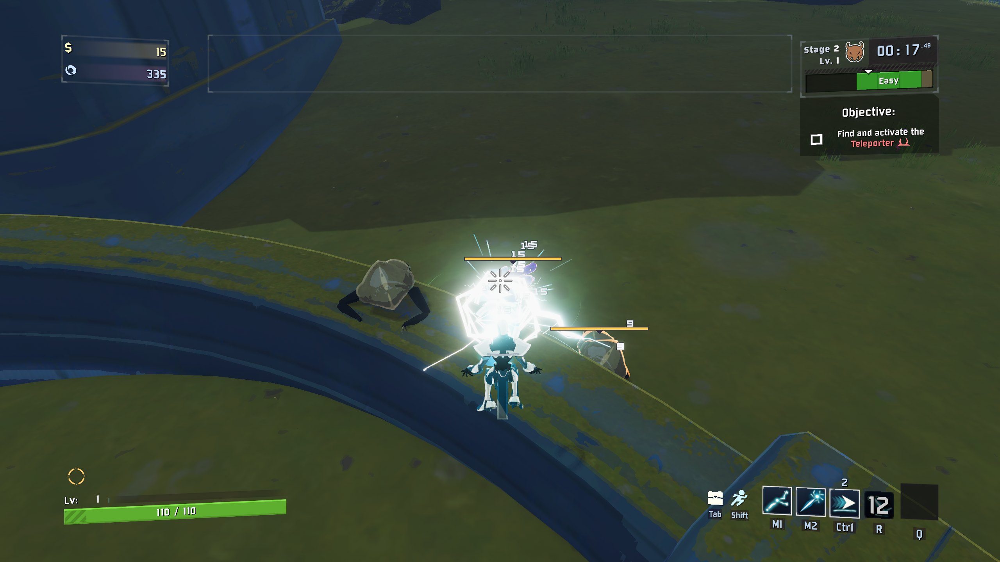

<p align="center"><b>English</b> | <a href="https://github.com/johnstonstu/ror2-hollow-saint/blob/main/README.zh-CN.md">简体中文</a> | <a href="https://github.com/johnstonstu/ror2-hollow-saint/blob/main/README.ru.md">Русский</a> | <a href="https://github.com/johnstonstu/ror2-hollow-saint/blob/main/README.pt-BR.md">Português (BR)</a></p>

<p align="center">
  
</p>

<p align="center">
  <a href="https://thunderstore.io/c/riskofrain2/p/JohnstonStu/Hollow_Saint/"></a>
  <a href="LICENSE"></a>
</p>

<p align="center"><b>A cracked devotional icon that answers only to the storm.</b></p>

Hollow Saint is an original **Risk of Rain 2 survivor** who turns a crowded fight into a gathering storm. Chain lightning through a pack, charge a spear in your other hand, and watch each Electrocute light your halo until a Thunderbolt answers from above.

**Keep the pressure on. Choose your moment to commit. Blink to a better angle.** Arc Bolt and Stormspear work together; your special changes how you approach the fight. Rise above a line of enemies with **Gaze of the Hollow**, or carry **Open Circuit** into close range and keep attacking beneath a striking crown.

**[Install on Thunderstore](https://thunderstore.io/c/riskofrain2/p/JohnstonStu/Hollow_Saint/)** · **[Skills](#the-kit)** · **[Combos](#put-it-together)** · **[Feedback](https://github.com/johnstonstu/ror2-hollow-saint/issues)**

> **Early access:** Hollow Saint is still being tuned. Expect balance changes and the occasional bug; your feedback helps shape the next patch. In-game skill descriptions show the numbers for your current configuration.

<p align="center"></p>

*Gaze from the player's view: the halo projects ahead of the Saint, with lightning connecting to struck enemies. Captured in a development encounter with the normal gameplay camera and HUD.*

## The kit

**Answered Prayer · Passive**

Your hits build **Static** on enemies. Full Static triggers an **Electrocute**, spreading the storm to nearby targets and lighting an orb on your halo. Fill the halo and a **Thunderbolt** strikes a strong enemy in sight. Staying on a pack keeps this cycle moving.

**Arc Bolt · Primary**

Your steady attack: snap lightning into a target and let it chain to nearby enemies. Keep firing while you charge Stormspear to build pressure between throws.

**Stormspear · Secondary**

Hold to form a spear of lightning, then release to throw. The spear sticks and bursts around its impact; aim into a group to catch its neighbours. A longer charge makes the throw stronger, while Arc Bolt stays available in your other hand.

**Arc Step · Utility**

Two charges of a short blink, usable on the ground or in the air. Look upward to gain height, or jump out of a step to carry its momentum. Spend a charge to find a firing angle; keep the other for an escape.

**Gaze of the Hollow · Special**

Rise and project your halo forward to channel a piercing lightning beam. Sweep it along a line of enemies as its reach grows. Ground tendrils surround the channel, while separate lightning connectors mark enemies actually hit. Recast or use Arc Step to end the channel early.

**Open Circuit · Alternate special**

Open the halo into a crown that repeatedly strikes nearby enemies while you keep fighting. Stormspear forms overhead and charges faster; a fully charged crown spear calls a Thunderbolt. Choose it when you want to fight close and keep your other attacks flowing.

## Put it together

- **Bolts into spear.** Keep Arc Bolt firing while you charge Stormspear. Release into the centre of the pack, then keep landing hits as the spear bursts and Static spreads.
- **Step into Gaze.** Blink to an angle that lines enemies up, channel across them, then recast or Arc Step when you need to move again. Gaze grants bonus armor during the channel, but positioning still matters.
- **Crown into pressure.** Activate Open Circuit near a group. Fire Arc Bolt and use the faster spear charge while the crown strikes around you; Arc Step helps you adjust your distance.

## Skins

Five skins give the Saint a different halo and lightning colour: **Cracked Icon**, **Obsidian Saint**, **Verdigris Relic**, **Solar Vespers** and **Umbral Choir**.


## Install and support

Install with [r2modman or the Thunderstore Mod Manager](https://thunderstore.io/c/riskofrain2/p/JohnstonStu/Hollow_Saint/) to get the dependencies automatically. The [full player guide](HollowSaintMod/Package/README.md#install) includes manual installation, options, skill footage and bug-report instructions. See the [release notes](HollowSaintMod/Package/CHANGELOG.md) for changes.

Balance and presentation options are available in **Settings > Mod Options > Hollow Saint** and `BepInEx/config/com.johnstonstu.hollowsaint.cfg`.

**Playtest status:** multiplayer has not had a real playtest yet, and physical controller acceptance remains unverified. Every multiplayer participant should use the same mod version and config.

**Also by JohnstonStu:** [AH64](https://thunderstore.io/c/riskofrain2/p/JohnstonStu/AH64/), an Apache attack helicopter survivor.

## Languages

Hollow Saint follows the language you set in Risk of Rain 2. Simplified Chinese, Russian and Brazilian Portuguese ship with the mod; any other language shows the English text. The Mod Options menu stays in English. The Chinese, Russian and Brazilian Portuguese text is machine-translated, and corrections are welcome in a [translation issue](https://github.com/johnstonstu/ror2-hollow-saint/issues/new?template=translation.md). See [docs/TRANSLATING.md](docs/TRANSLATING.md).

## Repo

| Path | Contents |
|---|---|
| `HollowSaintMod/` | BepInEx plugin (C#, netstandard2.1). `Language/HollowSaint.language` is the in-game text. `Package/` holds the Thunderstore manifest, README, changelog and icon |
| `HollowSaintUnityProject/` | Unity 2021.3.33f1 project that builds the `hollowsaintassets` bundle (current generation: `GameFoundation11`-`15`, with clips from `GameFoundation10r1`) |
| `art/audio/` | Wwise project and the generated `HollowSaint.bnk` (the Pixabay samples stay local, see `.gitignore`) |
| `tools/dev-profile/` | Build staging into the `Hollow Saint Dev` r2modman profile, the scripted autopilot playtest |
| `tools/release/` | Packaging, clean-profile install test, README footage |
| `tools/tests/` | Offline checks for the presentation, kit math and language file (`Check-Language.ps1`) |
| `docs/` | Design and architecture docs; `docs/media/` is the README media, `docs/dev/` the playtest log and to-do list |

Older model generations, concepts and Blender sources are kept out of this repo to keep clones small.

## Build and test

Risk Of Options is not on NuGet. The build looks for `RiskOfOptions.dll` in `HollowSaintMod/lib/` (git-ignored), then in the `Hollow Saint Dev` r2modman profile; or pass `-p:RiskOfOptionsDll=<path>`.

```
dotnet build HollowSaintMod/HollowSaint.csproj -c Release --no-restore
powershell -ExecutionPolicy Bypass -File tools\dev-profile\Stage-Build.ps1 -SkipBuild
```

Then launch the `Hollow Saint Dev` profile from r2modman. `Stage-Build.ps1` copies `HollowSaint.language` into the plugin folder next to the DLL, and runs `Check-Access.ps1`, which fails the stage if the DLL touches a private game member through the publicized reference.

```
powershell -ExecutionPolicy Bypass -File tools\tests\Check-Language.ps1
```

Scripted playtest (hosts a solo run, plays a fixed skill script, writes screenshots and a trace to `artifacts/<name>`):

```
powershell -ExecutionPolicy Bypass -File tools\dev-profile\Run-Autopilot.ps1 -Name autopilot01
```

Set `HS_SEGMENTS` first to run one script (`items`, `storm`, `gaze`, `polish`, `showcase`, ...). The autopilot only runs when the launcher sets `HS_AUTOPILOT`; players never see it.

## Release

1. Bump `Plugin.Version`, the project `<Version>`, and `Package/manifest.json` together, and add a `CHANGELOG.md` entry.
2. `tools\release\Make-Package.ps1` builds `artifacts\release\JohnstonStu-Hollow_Saint-<version>.zip` from the Release DLL and the playtested bundle.
3. `tools\release\New-CleanProfile.ps1 -Package artifacts\release\JohnstonStu-Hollow_Saint-<version>` builds a `Hollow Saint Clean` profile with only the declared dependencies and no config (`-NoRiskOfOptions` tests the soft-dependency path); play it once to catch missing dependencies or default-config problems.
4. README footage: `tools\release\Record-Showcase.ps1 -Name showcaseNN` records the showcase script (game window only), then `tools\release\Make-ReadmeMedia.ps1 -Name showcaseNN` writes the animated WebP clips and the skin lineup to `docs/media` (the showcase hides the HUD, and films the skins and the hero shot from the front). The Thunderstore README loads them from `main` on GitHub, so push before uploading.

## License

Code and original art: [MIT](LICENSE). The sound effects in `HollowSaint.bnk` are built from Pixabay samples (Pixabay Content License); the samples themselves are not in this repo.

## Logging

A normal session writes one line to the BepInEx log ("Hollow Saint <version> loaded.") plus any real warnings or errors. Config `6. Misc` > `Verbose log` turns the load diagnostics back on for bug reports; `Event log` adds the first occurrences of each gameplay event.
