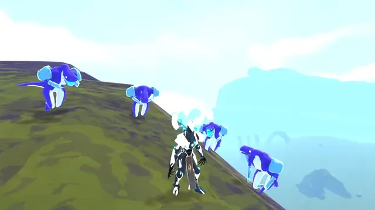

<p align="center">
  
</p>

<p align="center">
  <a href="https://thunderstore.io/c/riskofrain2/p/JohnstonStu/Hollow_Saint/"></a>
  <a href="LICENSE"></a>
</p>

An original Risk of Rain 2 survivor built around chain lightning: bolts that leap between enemies, a spear of lightning that sticks and bursts, and a storm passive that answers your hits with Thunderbolts.

<p align="center"></p>

**Players:** the full description (every skill with footage, the storm, skins, install, options) is the Thunderstore README: [HollowSaintMod/Package/README.md](HollowSaintMod/Package/README.md). Release notes are in [CHANGELOG.md](HollowSaintMod/Package/CHANGELOG.md).

| Slot | Skill |
|---|---|
| Passive | **Answered Prayer**: hits build Static; full Static Electrocutes; every 5 Electrocutes call a Thunderbolt |
| Primary | **Arc Bolt**: 100% bolt that chains to 3 more enemies |
| Secondary | **Stormspear**: hold to charge, 400% to 1600%; sticks, then bursts around the target |
| Utility | **Arc Step**: two-charge blink in any direction, even in the air |
| Special | **Gaze of the Hollow**: rise and fire a 4 s forking beam |
| Special (alt) | **Open Circuit**: 10 s crown that strikes everything within 8 m |


**Also by JohnstonStu:** [AH64](https://thunderstore.io/c/riskofrain2/p/JohnstonStu/AH64/), an Apache attack helicopter survivor.

## Repo

| Path | Contents |
|---|---|
| `HollowSaintMod/` | BepInEx plugin (C#, netstandard2.1). `Package/` holds the Thunderstore manifest, README, changelog and icon |
| `HollowSaintUnityProject/` | Unity 2021.3.33f1 project that builds the `hollowsaintassets` bundle (current generation: `GameFoundation11`-`15`, with clips from `GameFoundation10r1`) |
| `art/audio/` | Wwise project and the generated `HollowSaint.bnk` (the Pixabay samples stay local, see `.gitignore`) |
| `tools/dev-profile/` | Build staging into the `Hollow Saint Dev` r2modman profile, the scripted autopilot playtest |
| `tools/release/` | Packaging, clean-profile install test, README footage |
| `tools/tests/` | Offline checks for the presentation and kit math |
| `docs/` | Design and architecture docs; `docs/media/` is the README media, `docs/dev/` the playtest log and to-do list, `docs/archive/` past handoffs and plans |

Older model generations, concepts and Blender sources are kept out of this repo to keep clones small.

## Build and test

Risk Of Options is not on NuGet. The build looks for `RiskOfOptions.dll` in `HollowSaintMod/lib/` (git-ignored), then in the `Hollow Saint Dev` r2modman profile; or pass `-p:RiskOfOptionsDll=<path>`.

```
dotnet build HollowSaintMod/HollowSaint.csproj -c Release --no-restore
powershell -ExecutionPolicy Bypass -File tools\dev-profile\Stage-Build.ps1 -SkipBuild
```

Then launch the `Hollow Saint Dev` profile from r2modman. `Stage-Build.ps1` also runs `Check-Access.ps1`, which fails the stage if the DLL touches a private game member through the publicized reference.

Scripted playtest (hosts a solo run, plays a fixed skill script, writes screenshots and a trace to `artifacts/<name>`):

```
powershell -ExecutionPolicy Bypass -File tools\dev-profile\Run-Autopilot.ps1 -Name autopilot01
```

Set `HS_SEGMENTS` first to run one script (`items`, `storm`, `gaze`, `polish`, `showcase`, ...). The autopilot only runs when the launcher sets `HS_AUTOPILOT`; players never see it.

## Release

1. Bump `Plugin.Version` and `Package/manifest.json` together, and add a `CHANGELOG.md` entry.
2. `tools\release\Make-Package.ps1` builds `artifacts\release\JohnstonStu-Hollow_Saint-<version>.zip` from the Release DLL and the playtested bundle.
3. `tools\release\New-CleanProfile.ps1 -Package artifacts\release\JohnstonStu-Hollow_Saint-<version>` builds a `Hollow Saint Clean` profile with only the declared dependencies and no config (`-NoRiskOfOptions` tests the soft-dependency path); play it once to catch missing dependencies or default-config problems.
4. README footage: `tools\release\Record-Showcase.ps1 -Name showcaseNN` records the showcase script (game window only), then `tools\release\Make-ReadmeMedia.ps1 -Name showcaseNN` writes the animated WebP clips and the skin lineup to `docs/media` (the showcase hides the HUD, and films the skins and the hero shot from the front). The Thunderstore README loads them from `main` on GitHub, so push before uploading.

## License

Code and original art: [MIT](LICENSE). The sound effects in `HollowSaint.bnk` are built from Pixabay samples (Pixabay Content License); the samples themselves are not in this repo.

## Logging

A normal session writes one line to the BepInEx log ("Hollow Saint <version> loaded.") plus any real warnings or errors. Config `6. Misc` > `Verbose log` turns the load diagnostics back on for bug reports; `Event log` adds the first occurrences of each gameplay event.
