<p align="center"><b>English</b> | <a href="README.zh-CN.md">简体中文</a> | <a href="README.ru.md">Русский</a> | <a href="README.pt-BR.md">Português (BR)</a></p>

<p align="center">
  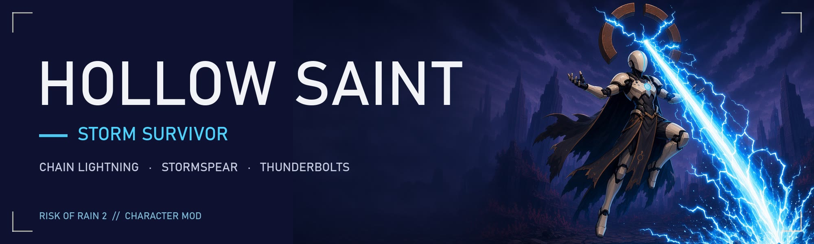
</p>

<p align="center">
  <a href="https://thunderstore.io/c/riskofrain2/p/JohnstonStu/Hollow_Saint/"></a>
  <a href="https://thunderstore.io/c/riskofrain2/p/JohnstonStu/Hollow_Saint/"></a>
  <a href="LICENSE"></a>
</p>

<h3 align="center">A cracked devotional icon that answers only to the storm.</h3>

<p align="center">Chain lightning through a pack, pin the biggest threat with a spear of lightning, and bank every Electrocute as a Static Charge.<br>Throw a crackling Hollowed Orb, feed the crown for Gaze or Open Circuit, or send a Thundercloud across a broad aimed area.</p>

<p align="center"><a href="https://thunderstore.io/c/riskofrain2/p/JohnstonStu/Hollow_Saint/"><b>Install</b></a> · <a href="#whats-new-in-13"><b>What's new in 1.3</b></a> · <a href="#the-kit"><b>Skills</b></a> · <a href="#how-the-storm-works"><b>The storm</b></a> · <a href="https://github.com/johnstonstu/ror2-hollow-saint/issues"><b>Feedback</b></a></p>

<p align="center">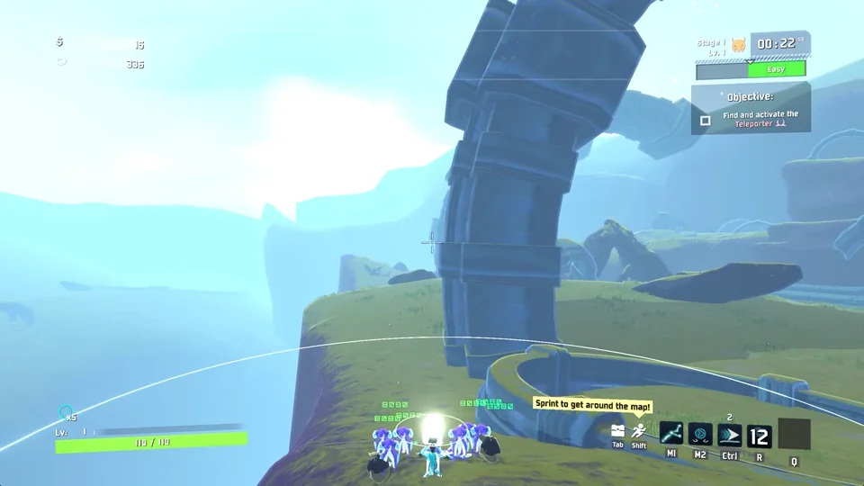</p>

<p align="center">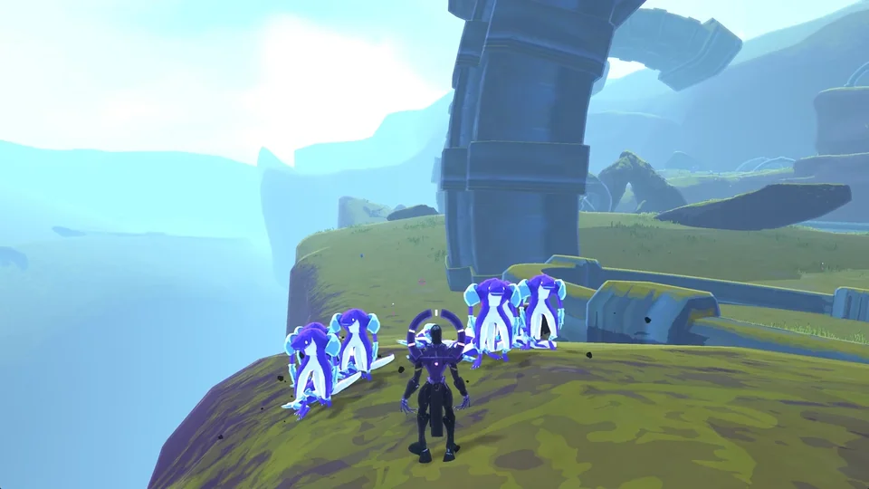 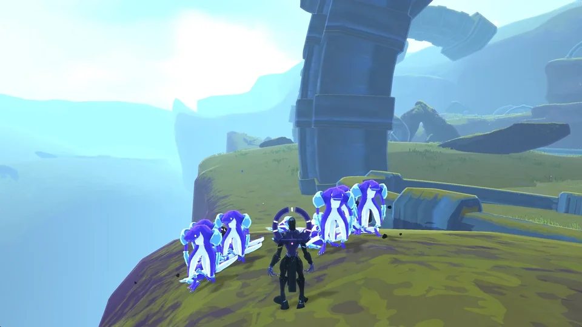</p>

## What's new in 1.3

**Updated for the October 2026 game patch.** Update your core dependencies (BepInExPack, R2API, HookGenPatcher) in your mod manager along with Hollow Saint.

Select **Hollowed Orb** as your alternate Secondary or **Thundercloud** as your third Special. Orb works without Static: short throws preserve your bank, while holding past 0.5 seconds gathers charges for more power. Thundercloud is free to cast too: tap for a small free storm, or hold to pour in charges. Early release keeps unused charges, and Utility cancels gathering into Arc Step.

- **Hollowed Orb:** a big two-handed lightning ball with 70 m launch range and 18–36 m bounce reach as charges increase. A free tap throws a 0.6 m ball that deals 297% per hit for 3 hits. Each gathered charge adds damage (up to 657% per hit at five charges) and one more hit (up to 8), growing the ball to 1 m. It favors crosshair alignment for its first target, then visits fresh enemies before revisits; each revisit on the same enemy keeps 75% of its previous damage. With nothing else in reach it latches onto its target and zaps its remaining hits there, then bursts in a small area (3 m free, +0.8 m per charge) for 60% of its hit damage. Every hit primes Static. Visible lightning flows from chest and arms into the ball. Open Circuit gathers and launches it above your head, leaving Primary attacks available.
- **Open Circuit:** hold Special to feed at least one stored charge into the crown, then release to open it. One/three/five charges give 1x/1.5x/2x area pulse density and more crown arcs. Radius, duration and per-pulse damage remain the same; extra pulses do not accelerate Static generation. Its crown is now a Closed Circuit: see the storm loop note below.
- **Thundercloud:** a lingering storm that is free to cast with an empty bank: tap for a small free storm, or hold to pour in charges. It rises fast and stays 3 seconds free, +1 second per charge (8 seconds at five charges). Every 0.75 seconds it strikes every enemy beneath it within its radius (12 m free, 16 m at one charge, 30 m at five) for 81% free, up to 162% per strike at five charges, leaving them Shocked and primed. Aim at an enemy or terrain within 80 m; it can also be placed on an empty area.

New casts use your mapped Secondary, Special and Utility controls. Base cooldowns are 7 seconds for Orb and 12 seconds for Thundercloud, starting after their cast ends. Mod Options adjusts their damage, range, size and cooldowns; in-game text follows your settings.

**Storm and reach refinement:** Thundercloud is now a lingering storm that strikes every 0.75 seconds for as long as it lasts (3–8 seconds), with branching visual return strokes on each target. Orb bounce reach grows with gathered charges: 18 m free/one charge, 27 m at three and 36 m at five.

> **Early access:** Hollow Saint is still being tuned, so expect balance changes and the occasional bug. Your feedback shapes the next patch. In-game skill descriptions always show the numbers for your current settings.

**Early-game pressure:** Arc Bolt now deals 144% damage per direct hit (was 108%), at the same fire rate and proc coefficients. Only the exact previous default migrates; custom damage settings stay yours.

**Latching orb:** when nothing else is in reach, Hollowed Orb latches onto its target and zaps its remaining hits there, then bursts in a small area (3 m free, +0.8 m per charge) for 60% of its hit damage. Fresh enemies still come first.

**Lightning ball:** animated crackling bolts wrap the orb while gathering and flying. Impacts add branching lightning, sparks, shock rings and electrical hit sounds in your skin’s colors.

**Storm loop:** every skill that spends Static Charges now primes Static on what it hits (Hollowed Orb, Thundercloud, Gaze blasts and surges, the Thunderbolt's splash), up to 95% but never full, and Thundercloud also Shocks. Finishers (Arc Bolt, Stormspear, the Gaze beam and Open Circuit) tip primed enemies into Electrocutes and bank the charges back. Stormspear builds double Static on primed enemies, and a full bank now only goes into a fully charged throw. Open Circuit is a **Closed Circuit**: Electrocutes within 12 m return the charges you fed it, and any still in the crown burst out as a crown nova when it closes (12 m, 150% damage per leftover charge, priming what it hits). A light income guard (2 charges per second) keeps late-game packs from flooding the bank. Charge gathering ticks every 0.25 seconds.

## The kit

| | Skill | Slot | In short |
|:-:|---|---|---|
| 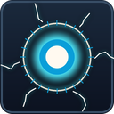 | **Answered Prayer** | Passive | Hits build Static; Electrocutes bank Static Charges. |
|  | **Arc Bolt** | Primary | A fast bolt that chains through a pack. |
|  | **Stormspear** | Secondary | Hold, throw, stick, burst. |
|  | **Arc Step** | Utility | Two blinks, on the ground or in the air. |
| 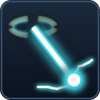 | **Gaze of the Hollow** | Special | Charge up, hover, burn a line through them. |
| 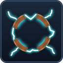 | **Open Circuit** | Alt. special | A striking crown while you keep fighting. |
| | **Hollowed Orb** | Alt. secondary | Gather, throw and ping-pong through the pack. |
| | **Thundercloud** | Third special | A free, lingering storm that strikes everything beneath it. |

<h3> Answered Prayer <sub>Passive</sub></h3>

Eligible hits build **Static** on enemies. Full Static **Electrocutes**: the enemy is shocked and the arc jumps to its neighbours. Every Electrocute stores a **Static Charge** (up to five). A full bank turns your next Stormspear throw into a **Thunderbolt**. Gaze spends charges on its blasts and surges; Hollowed Orb, Thundercloud and Open Circuit gather charges individually and spend the gathered count on release. Charges never go off on their own.

<p align="center">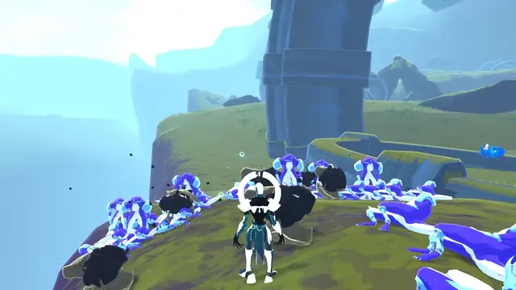</p>

<h3> Arc Bolt <sub>Primary</sub></h3>

Snap a bolt that chains to up to three more enemies. It is your steady pressure and the fastest way to spread Static across a group.

<p align="center">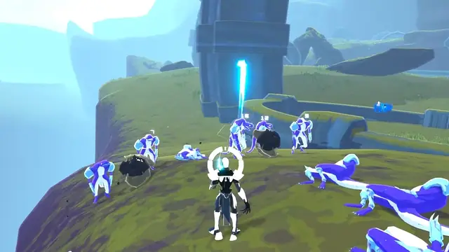</p>

<h3> Stormspear <sub>Secondary</sub></h3>

Hold to form a spear of lightning, release to throw. It sticks in what it hits, then bursts in a dome of lightning that grows with charge. A full charge also calls a lightning strike; a fully charged throw with a full Static bank turns it into a Thunderbolt that primes the pack around it. Spear hits build double Static on primed enemies, which makes it the Secondary for finishing what your Special sets up.

<p align="center">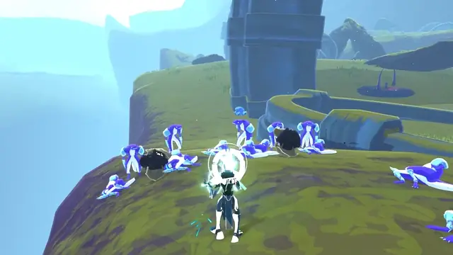</p>

### Hollowed Orb — alternate Secondary

Tap and release for a free two-handed lightning ball: 297% damage per hit, three hits and a substantial 0.6 m ball. Holding past 0.5 seconds gathers one stored charge at a time; each charge adds damage (up to 657% per hit at five charges) and one more hit (up to 8). Diameter grows to 1 m, launch range is 70 m and bounce reach grows from 18 m to 36 m at five charges. Each revisit on the same enemy keeps 75% of that enemy’s previous hit damage; a new enemy receives the full first-hit value. Aim assistance favors the crosshair and respects walls. Every hit primes Static, which makes the free tap the Secondary for setting up your Special and Arc Bolt.

Fresh enemies come first. When nothing else is in reach, the orb latches onto its target and zaps its remaining hits there, which keeps the free orb useful against a nearby lone boss without spending the charges you are saving for an ultimate. When it is spent it bursts in a small area (3 m free, +0.8 m per charge) for 60% of its hit damage. Utility cancels gathering and returns its fuel and stock. During Open Circuit, the orb gathers and launches overhead, leaving Primary available. Base recharge: 7 seconds after the cast ends.

### Thundercloud — third Special

Free to cast with an empty bank: tap for a small free storm, or hold Special to pour charges into the crown, then release over your aimed group. The crown rises fast and the storm lingers for 3 seconds free, +1 second per charge (8 seconds at five charges). Every 0.75 seconds it strikes every enemy beneath it within its radius (12 m free, 16 m at one charge, 30 m at five) for 81% free, up to 162% per strike at five charges, leaving them Shocked and primed. Aim range is 80 m and it can be placed on an empty area. Utility cancels gathering. Base recharge: 12 seconds after the storm ends.

<h3> Arc Step <sub>Utility</sub></h3>

Blink a short way in any direction, even mid-air. Look up to climb, and jump out of a step to keep its momentum. Two charges: one to find an angle, one to get out.

<p align="center">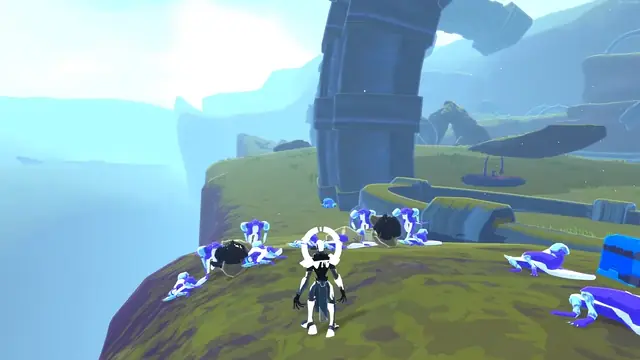</p>

<h3> Gaze of the Hollow <sub>Special</sub></h3>

Hold to draw your Static Charges into the crown, then rise and channel a piercing beam for seven seconds. The beam opens by firing everything you gathered in one blast (400% per charge). While it burns, hold and release Primary for surges, each with a lock-on bolt (100% per charge) at the nearest enemy within 8 m. You take less damage while you gather and channel. Tap Special to skip the charge-up; Special or UI Cancel ends the beam early, and Utility exits straight into your Arc Step. The opening blast, surges and lock-on strikes prime what they hit, so the beam finishes them off.

<p align="center">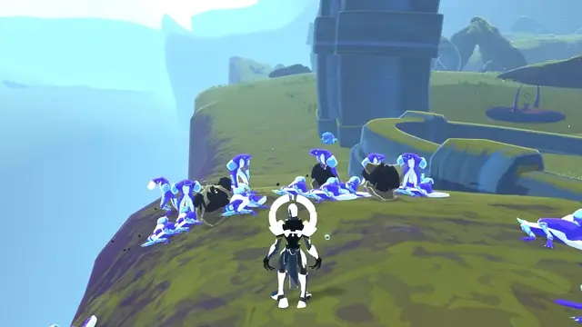</p>

<h3> Open Circuit <sub>Alternate special</sub></h3>

Hold Special to feed at least one Static Charge into the crown, then release. The crown strikes everything around you for ten seconds while you keep fighting; more gathered charges increase lightning density. Stormspear charges much faster under it, and a full Static bank upgrades its lightning strike to a Thunderbolt. Hollowed Orb gathers and launches above your head while Primary remains available. Enemies that stay inside for three seconds take an extra zap. **Closed Circuit:** each Electrocute within 12 m returns one fed charge; any still in the crown when it closes burst out as one 12 m nova for 150% damage per leftover charge, priming what it hits, or return to your bank if no enemy is in the nova.

<p align="center">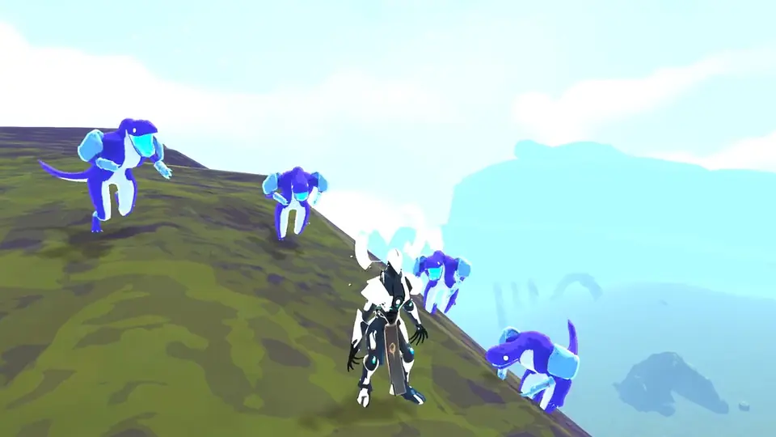</p>

## How the storm works

<p align="center">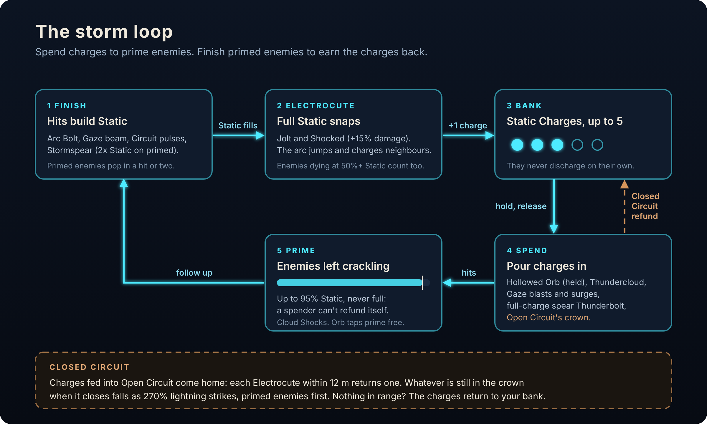</p>

Hollow Saint runs on one loop: **finishers** earn Static Charges, **spenders** use them, and everything a spender hits is left **primed** for the next finisher.

1. **Static.** Eligible hits charge the enemy. Bigger hits, critical strikes and high-proc items charge it faster. It fades if you stop hitting.
2. **Electrocute.** At full Static the enemy is jolted (not bosses) and **Shocked**, taking extra damage for a moment. The arc jumps to nearby enemies and charges them too. Each Electrocute banks one **Static Charge**, up to five.
3. **Spend and prime.** Every skill that spends charges also primes what it hits, leaving it at up to 95% Static. It never fills the meter itself, so a spender can never pay for itself.
4. **Finish.** Arc Bolt, Stormspear, the Gaze beam and Open Circuit's pulses tip primed enemies over. A primed pack Electrocutes in a hit or two and your bank refills.

| Role | Skills | In the loop |
|---|---|---|
| Finisher | Arc Bolt, Stormspear, Gaze beam, Open Circuit pulses | Build Static, Electrocute, bank charges. Stormspear builds double Static on primed enemies. |
| Spender | Hollowed Orb (held), Thundercloud, Gaze blasts and surges, full-bank Thunderbolt | Turn charges into damage and leave targets primed. Thundercloud also Shocks. |
| Free primer | Hollowed Orb (tap), Thundercloud (free) | Both prime without spending anything: the easiest way to start the loop. |
| Payback | Open Circuit | Fed charges come back from Electrocutes within 12 m; leftovers burst as a crown nova when it closes. |

Nothing takes your charges unless you held a skill for them: quick spear throws and quick Orb taps never touch the bank. A light income guard (2 charges per second, adjustable) keeps huge late-game packs from flooding it.

## Build-outs

Your Secondary decides how you start and finish the loop; your Special decides how you spend it.

<p align="center">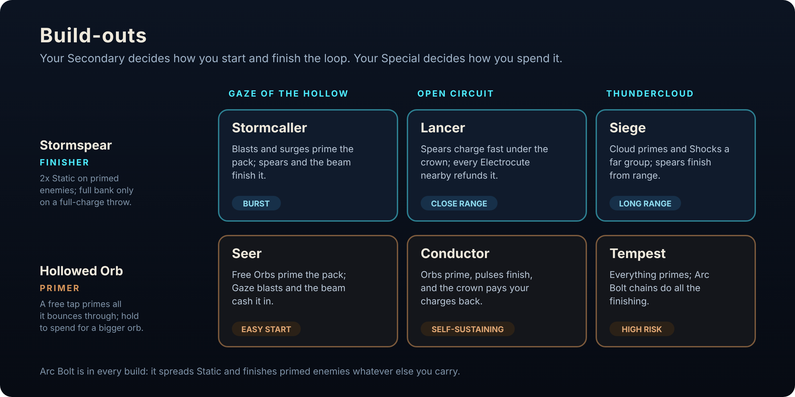</p>

| Build | Loadout | How it loops | Watch for |
|---|---|---|---|
| **Stormcaller** | Stormspear + Gaze | Arc Bolt spreads Static and the bank fills. Open Gaze on the pack: blasts and surges prime, the beam and your spears finish. | Spear and Gaze share one bank; only fully charged throws spend it. |
| **Lancer** | Stormspear + Open Circuit | Under the crown Stormspear charges much faster. Throw into primed enemies while pulses work the rest; every Electrocute nearby refunds the crown. | Stay within 12 m of the fight for refunds. |
| **Siege** | Stormspear + Thundercloud | Drop a cloud on a distant group to prime and Shock it, then finish from range with spears and Arc Bolt chains. | A free storm still primes; save charges for the big one or a full-charge spear. |
| **Seer** | Hollowed Orb + Gaze | Free Orbs prime the pack, then Gaze blasts and the beam cash it in. | Orbs never finish on their own; the beam and Arc Bolt do. |
| **Conductor** | Hollowed Orb + Open Circuit | Free Orbs prime, feed charges into the crown and fight inside it. Pulses finish primed enemies, refunds keep the bank topped up and leftovers burst as a crown nova. The most self-sustaining build. | Overhead Orbs keep Primary free during the crown. |
| **Tempest** | Hollowed Orb + Thundercloud | Everything primes: cloud and Orbs light up the pack, and Arc Bolt chains do all the finishing. High risk, high reward. | Free storms keep the loop going; charged storms empty the bank fast. |

## Skins

Six skins, each with its own halo and lightning colour. **Crimson Vow** is the mastery skin: win or obliterate on Monsoon as Hollow Saint.

<p align="center">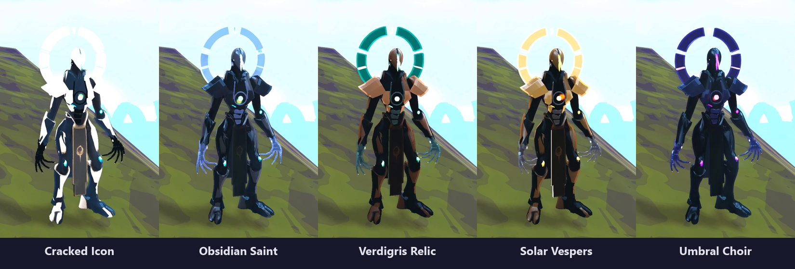</p>

## Install

**Mod manager (recommended):** install with [r2modman](https://thunderstore.io/c/riskofrain2/p/ebkr/r2modman/) or the Thunderstore Mod Manager; the dependencies come with it.

**Manual:** install the dependencies listed on this page, then copy the package's `plugins/HollowSaint` folder into `BepInEx/plugins/`. Keep `HollowSaint.dll`, `hollowsaintassets` and `HollowSaint.language` together in that folder.

## Options

Damage, range, cooldown and presentation settings are in **Settings → Mod Options → Hollow Saint** ([Risk Of Options](https://thunderstore.io/c/riskofrain2/p/Rune580/Risk_Of_Options/), installed with the mod) and in `BepInEx/config/com.johnstonstu.hollowsaint.cfg`, along with presentation toggles: spear hand, item displays, arm motion and impact feel.

## Languages

The mod follows the language you set in Risk of Rain 2. Simplified Chinese, Russian and Brazilian Portuguese are included (machine-translated; corrections are welcome in a [translation issue](https://github.com/johnstonstu/ror2-hollow-saint/issues/new?template=translation.md)). Any other language shows English. The Mod Options menu stays in English.

## Feedback and known limitations

Bugs and balance notes are welcome on [GitHub issues](https://github.com/johnstonstu/ror2-hollow-saint/issues). For a bug report, turn on **Verbose log** (Mod Options → 6. Misc), reproduce it and attach `BepInEx/LogOutput.log` with the stage and what you were doing.

- **Multiplayer has not had a real playtest yet.** Skills are server-authoritative and networked, but expect rough edges. Every player should run the same version and config.
- **Physical controller acceptance is unverified.** Mention your controller and input setup with input reports.
- Item displays borrow Commando's placements, so a few items sit slightly off.

## Also by JohnstonStu

<table>
  <tr>
    <td><a href="https://thunderstore.io/c/riskofrain2/p/JohnstonStu/AH64/"></a></td>
    <td><b><a href="https://thunderstore.io/c/riskofrain2/p/JohnstonStu/AH64/">AH64</a></b>: an Apache attack helicopter survivor. It hovers and never lands, with a chain gun, Hydra rockets, Hellfire and Longbow missiles, and evasive rolls.</td>
  </tr>
</table>

## Credits and license

- Created by JohnstonStu: design, code, model, animation and effects.
- Lightning strike sounds built from Pixabay samples (Pixabay Content License). Other sounds are original.
- Built with BepInEx, R2API and Risk Of Options.

[MIT](LICENSE) © 2026 JohnstonStu.


## For developers

### Repo

| Path | Contents |
|---|---|
| `HollowSaintMod/` | BepInEx plugin (C#, netstandard2.1). `Language/HollowSaint.language` is the in-game text. `Package/` holds the Thunderstore manifest, README, changelog and icon |
| `HollowSaintUnityProject/` | Unity 2021.3.33f1 project that builds the `hollowsaintassets` bundle (current generation: `GameFoundation11`-`15`, with clips from `GameFoundation10r1`) |
| `art/audio/` | Wwise project and the generated `HollowSaint.bnk` (the Pixabay samples stay local, see `.gitignore`) |
| `tools/dev-profile/` | Build staging into the `Hollow Saint Dev` r2modman profile, the scripted autopilot playtest |
| `tools/release/` | Packaging, clean-profile install test, README footage |
| `tools/tests/` | Offline checks for the presentation, kit math and language file (`Check-Language.ps1`) |
| `docs/` | Design and architecture docs; `docs/media/` is the README media, `docs/dev/` the playtest log and to-do list |

Older model generations, concepts and Blender sources are kept out of this repo to keep clones small.

### Build and test

Risk Of Options is not on NuGet. The build looks for `RiskOfOptions.dll` in `HollowSaintMod/lib/` (git-ignored), then in the `Hollow Saint Dev` r2modman profile; or pass `-p:RiskOfOptionsDll=<path>`.

```
dotnet build HollowSaintMod/HollowSaint.csproj -c Release --no-restore
powershell -ExecutionPolicy Bypass -File tools\dev-profile\Stage-Build.ps1 -SkipBuild
```

Then launch the `Hollow Saint Dev` profile from r2modman. `Stage-Build.ps1` copies `HollowSaint.language` into the plugin folder next to the DLL, and runs `Check-Access.ps1`, which fails the stage if the DLL touches a private game member through the publicized reference.

```
powershell -ExecutionPolicy Bypass -File tools\tests\Check-Language.ps1
```

Scripted playtest (hosts a solo run, plays a fixed skill script, writes screenshots and a trace to `artifacts/<name>`):

```
powershell -ExecutionPolicy Bypass -File tools\dev-profile\Run-Autopilot.ps1 -Name autopilot01
```

Set `HS_SEGMENTS` first to run one script (`items`, `storm`, `gaze`, `polish`, `showcase`, ...). The autopilot only runs when the launcher sets `HS_AUTOPILOT`; players never see it.

### Release

Public publishing, pushes and media hosting each require Stuart’s explicit approval.

1. Bump `Plugin.Version`, the project `<Version>`, and `Package/manifest.json` together, and add a `CHANGELOG.md` entry.
2. `tools\release\Make-Package.ps1` builds `artifacts\release\JohnstonStu-Hollow_Saint-<version>.zip` from the Release DLL and the playtested bundle.
3. `tools\release\New-CleanProfile.ps1 -Package artifacts\release\JohnstonStu-Hollow_Saint-<version>` builds a `Hollow Saint Clean` profile with only the declared dependencies and no config (`-NoRiskOfOptions` tests the soft-dependency path); play it once to catch missing dependencies or default-config problems.
4. README footage: `tools\release\Record-Showcase.ps1 -Name showcaseNN` records the showcase script (game window only), then `tools\release\Make-ReadmeMedia.ps1 -Name showcaseNN` writes the animated WebP clips and the skin lineup to `docs/media` (the showcase hides the HUD, and films the skins and the hero shot from the front). The Thunderstore README loads them from `main` on GitHub, so push before uploading.

### Logging

A normal session writes one line to the BepInEx log ("Hollow Saint <version> loaded.") plus any real warnings or errors. Config `6. Misc` > `Verbose log` turns the load diagnostics back on for bug reports; `Event log` adds the first occurrences of each gameplay event.

