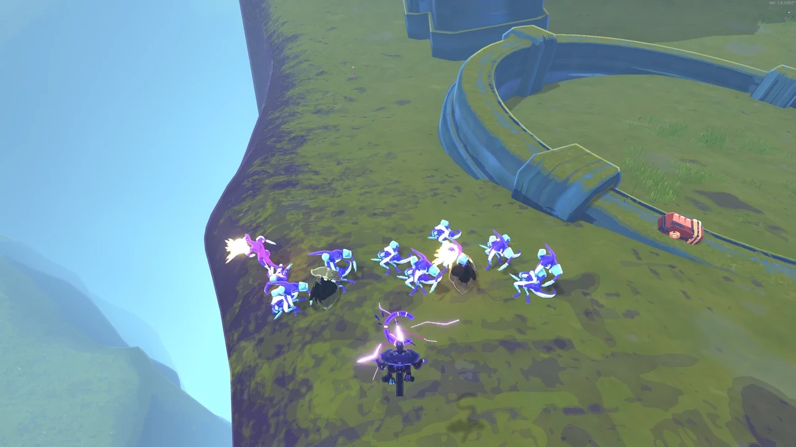

<p align="center"><a href="https://github.com/johnstonstu/ror2-hollow-saint/blob/main/README.md">English</a> | <a href="https://github.com/johnstonstu/ror2-hollow-saint/blob/main/README.zh-CN.md">简体中文</a> | <a href="https://github.com/johnstonstu/ror2-hollow-saint/blob/main/README.ru.md">Русский</a> | <b>Português (BR)</b></p>

> Esta página foi traduzida por máquina. Correções são bem-vindas: [abrir uma correção de tradução](https://github.com/johnstonstu/ror2-hollow-saint/issues/new?template=translation.md).

<p align="center">
  
</p>

<p align="center">
  <a href="https://thunderstore.io/c/riskofrain2/p/JohnstonStu/Hollow_Saint/"></a>
  <a href="LICENSE"></a>
</p>

Um sobrevivente original de Risk of Rain 2 feito em torno do raio em cadeia: setas que saltam entre inimigos, uma lança de relâmpago que crava e explode, e uma passiva de tempestade que responde aos seus acertos com Raios.

> **Acesso antecipado:** o Santo Oco ainda está sendo ajustado, então espere mudanças de balanceamento e algum bug de vez em quando. Seu retorno define o próximo patch de balanceamento.
>
> **[Reportar um bug ou comentar o balanceamento](https://github.com/johnstonstu/ror2-hollow-saint/issues)**

## Idiomas

O Santo Oco segue o idioma que você define em Risk of Rain 2. Chinês simplificado, russo e português do Brasil vêm com o mod; qualquer outro idioma mostra o texto em inglês. O menu de opções do mod continua em inglês. Essas três traduções foram feitas por máquina, e correções são bem-vindas numa [correção de tradução](https://github.com/johnstonstu/ror2-hollow-saint/issues/new?template=translation.md). Veja [docs/TRANSLATING.md](docs/TRANSLATING.md).

<p align="center"></p>

<p align="center"></p>

**Jogadores:** a descrição completa (cada habilidade com vídeo, a tempestade, aparências, instalação, opções) é o README da Thunderstore: [HollowSaintMod/Package/README.pt-BR.md](HollowSaintMod/Package/README.pt-BR.md). As notas de versão estão em [CHANGELOG.md](HollowSaintMod/Package/CHANGELOG.md).

| Espaço | Habilidade |
|---|---|
| Passiva | **Prece Atendida**: acertos acumulam Estática; Estática cheia Eletrocuta; a cada 5 Eletrocussões cai um Raio |
| Primária | **Seta em Arco**: seta de 100% que salta para até mais 3 inimigos |
| Secundária | **Lança da Tempestade**: segure para carregar, 400% a 1600%; crava e explode ao redor do alvo |
| Auxiliar | **Passo em Arco**: duas cargas, um teleporte curto em qualquer direção, mesmo no ar |
| Especial | **Olhar do Oco**: erga-se e dispare um feixe ramificado de 4 s |
| Especial (alternativa) | **Circuito Aberto**: coroa de 10 s que atinge tudo a até 8 m |


**Também de JohnstonStu:** [AH64](https://thunderstore.io/c/riskofrain2/p/JohnstonStu/AH64/), um sobrevivente helicóptero de ataque Apache.

## Repositório

| Caminho | Conteúdo |
|---|---|
| `HollowSaintMod/` | Plugin BepInEx (C#, netstandard2.1). `Language/HollowSaint.language` é o texto do jogo. `Package/` guarda o manifesto da Thunderstore, o README, o registro de mudanças e o ícone |
| `HollowSaintUnityProject/` | Projeto Unity 2021.3.33f1 que gera o pacote `hollowsaintassets` (geração atual: `GameFoundation11`–`15`, com clipes de `GameFoundation10r1`) |
| `art/audio/` | Projeto Wwise e o `HollowSaint.bnk` gerado (as amostras do Pixabay ficam locais, veja `.gitignore`) |
| `tools/dev-profile/` | Envio da build para o perfil r2modman `Hollow Saint Dev` e o playtest automático |
| `tools/release/` | Empacotamento, teste de instalação num perfil limpo, filmagem do README |
| `tools/tests/` | Checagens offline da apresentação, da matemática do kit e do arquivo de idioma (`Check-Language.ps1`) |
| `docs/` | Documentos de conceito e arquitetura; `docs/media/` é a mídia do README, `docs/dev/` o diário de playtest e a lista de tarefas |

Gerações antigas do modelo, conceitos e fontes do Blender ficam fora deste repositório para o clone continuar pequeno.

## Build e teste

Risk Of Options não está no NuGet. A build procura `RiskOfOptions.dll` em `HollowSaintMod/lib/` (ignorado pelo git) e depois no perfil r2modman `Hollow Saint Dev`; ou passe `-p:RiskOfOptionsDll=<path>`.

```
dotnet build HollowSaintMod/HollowSaint.csproj -c Release --no-restore
powershell -ExecutionPolicy Bypass -File tools\dev-profile\Stage-Build.ps1 -SkipBuild
```

Depois abra o perfil `Hollow Saint Dev` pelo r2modman. `Stage-Build.ps1` copia `HollowSaint.language` para a pasta do plugin, ao lado da DLL, e roda `Check-Access.ps1`, que falha o envio se a DLL tocar um membro privado do jogo pela referência publicizada.

```
powershell -ExecutionPolicy Bypass -File tools\tests\Check-Language.ps1
```

Playtest por script (abre uma partida solo, executa um roteiro fixo de habilidades e grava capturas e um rastro em `artifacts/<name>`):

```
powershell -ExecutionPolicy Bypass -File tools\dev-profile\Run-Autopilot.ps1 -Name autopilot01
```

Defina `HS_SEGMENTS` antes para rodar um roteiro (`items`, `storm`, `gaze`, `polish`, `showcase`, …). O piloto automático só roda quando o lançador define `HS_AUTOPILOT`; jogadores nunca o veem.

## Lançamento

1. Suba juntos `Plugin.Version` e `Package/manifest.json` e acrescente uma entrada em `CHANGELOG.md`.
2. `tools\release\Make-Package.ps1` gera `artifacts\release\JohnstonStu-Hollow_Saint-<version>.zip` a partir da DLL Release e do pacote já testado.
3. `tools\release\New-CleanProfile.ps1 -Package artifacts\release\JohnstonStu-Hollow_Saint-<version>` monta um perfil `Hollow Saint Clean` só com as dependências declaradas e sem config (`-NoRiskOfOptions` testa o caminho da dependência opcional); jogue uma vez para pegar dependência faltando ou problema de config padrão.
4. Filmagem do README: `tools\release\Record-Showcase.ps1 -Name showcaseNN` grava só a janela do jogo, depois `tools\release\Make-ReadmeMedia.ps1 -Name showcaseNN` escreve os WebP animados e a fileira de aparências em `docs/media` (a demonstração esconde o HUD e filma as aparências e o plano principal de frente). O README da Thunderstore carrega isso de `main` no GitHub, então faça push antes de enviar.

## Licença

Código e arte original: [MIT](LICENSE). Os sons em `HollowSaint.bnk` são feitos de amostras do Pixabay (Pixabay Content License); as amostras em si não estão neste repositório.

## Registro

Uma sessão normal escreve uma linha no log do BepInEx ("Hollow Saint <versão> loaded.") mais avisos e erros reais. A config `6. Misc` > `Verbose log` liga de novo o diagnóstico de carga para relatos de bug; `Event log` acrescenta as primeiras ocorrências de cada evento de jogo.
